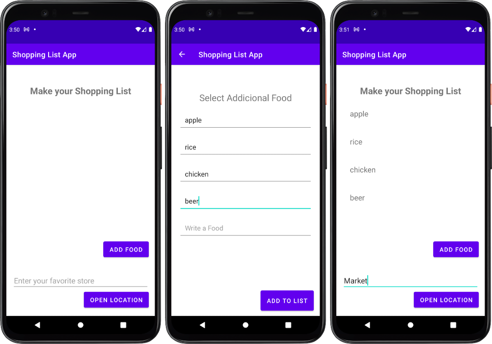

## Table of contents

- [Overview](#overview)
    - [The challenge](#the-challenge)
    - [Screenshot](#screenshot)
- [My process](#my-process)
    - [Built with](#built-with)
    - [What I learned](#what-i-learned)
    - [Continued development](#continued-development)
- [Author](#author)

## Overview

### The challenge

Users should be able to:

- Click in the Add Food Button and navigate to a screen that make a shopping list
- Add up to 5 itens and then submit the list to home screen from the Add To List Button
- Visualize in the home screen the list built
- Enter a name of a Store in the text input and then navigate to google maps to find the location store when clicked in the Button Open Location

### Screenshot

### Links

- Solution URL: [Solution](https://github.com/mlzzi/shopping-list-app)

## My process

### Built with

- Android Studio
- Java

### What I learned

- How the Activity lifecycle works.
- When an Activity starts, pauses, stops, and is destroyed.
- About the lifecycle callback methods associated with Activity changes.
- The effect of actions (such as configuration changes) that can result in Activity lifecycle events.
- How to retain Activity state across lifecycle events.
- How to create an implicit Intent, and use its actions and categories.
- How to use the ShareCompat.IntentBuilder helper class to create an implicit Intent for sharing data.
- How to advertise that your app can accept an implicit Intent by declaring Intent filters in the AndroidManifest.xml file.

### Continued development

I will continue to learn from the Google's platform and practice logic in a coding websites such CodeWars, HackerHank and LeetCode

## Author

- Linkedin - [Murilo Luzzi](https://www.linkedin.com/in/muriloluzzi/)
- GitHub - [@mlzzi](https://github.com/mlzzi)